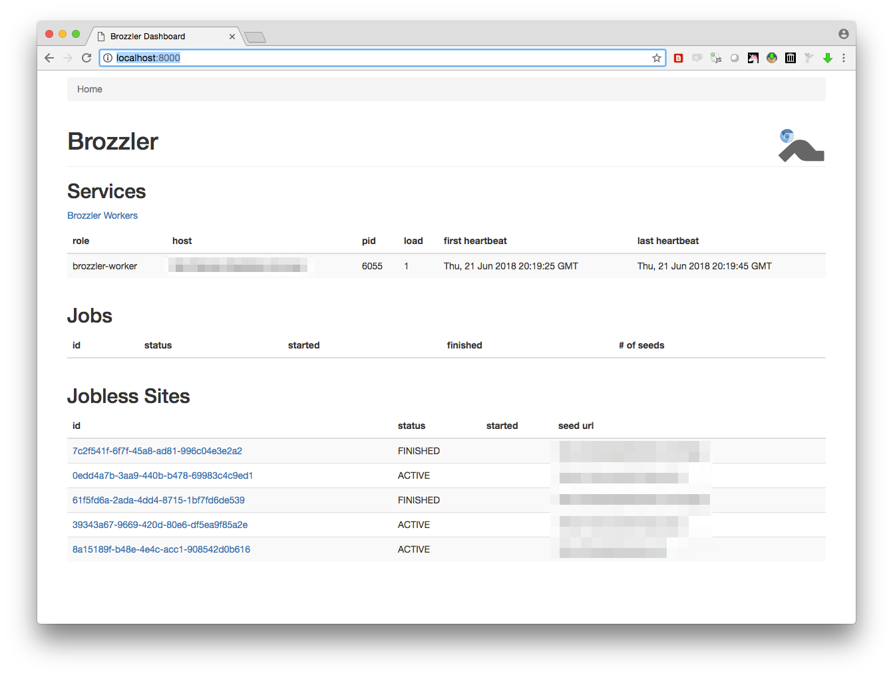
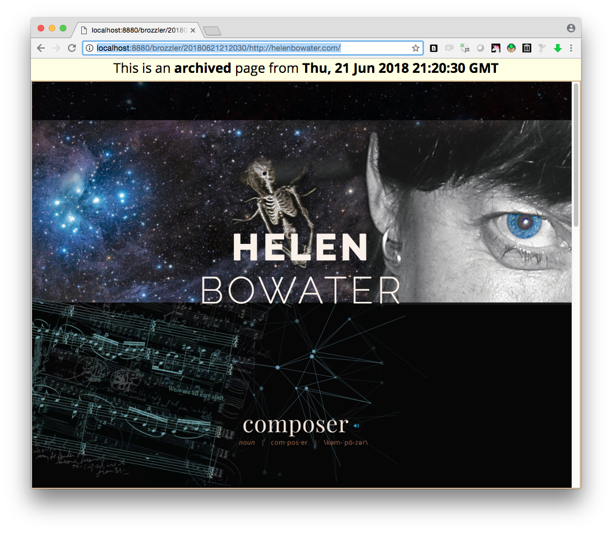

.. image:: https://api.travis-ci.org/internetarchive/brozzler.svg?branch=master
    :target: https://travis-ci.org/internetarchive/brozzler

.. |logo| image:: https://cdn.rawgit.com/internetarchive/brozzler/1.1b12/brozzler/dashboard/static/brozzler.svg
   :width: 60px

|logo| brozzler
===============
"browser" \| "crawler" = "brozzler"

Brozzler is a distributed web crawler (爬虫) that uses a real browser (Chrome
or Chromium) to fetch pages and embedded URLs and to extract links. It employs
`yt-dlp <https://github.com/yt-dlp/yt-dlp>`_ (formerly youtube-dl) to enhance media capture
capabilities and `rethinkdb <https://github.com/rethinkdb/rethinkdb>`_ to
manage crawl state.

Brozzler is designed to work in conjunction with warcprox for web archiving.

Requirements
------------

- Python 3.5 or later
- RethinkDB deployment
- Chromium or Google Chrome >= version 64

Note: The browser requires a graphical environment to run. When brozzler is run
on a server, this may require deploying some additional infrastructure,
typically X11. Xvnc4 and Xvfb are X11 variants that are suitable for use on a
server, because they don't display anything to a physical screen. The `vagrant
configuration <vagrant/>`_ in the brozzler repository has an example setup
using Xvnc4. (When last tested, chromium on Xvfb did not support screenshots,
so Xvnc4 is preferred at this time.)

Getting Started
---------------

The easiest way to get started with brozzler for web archiving is with
``brozzler-easy``. Brozzler-easy runs brozzler-worker, warcprox, brozzler
wayback, and brozzler-dashboard, configured to work with each other in a single
process.

Mac instructions:

::

    # install and start rethinkdb
    brew install rethinkdb
    # no brew? try rethinkdb's installer: https://www.rethinkdb.com/docs/install/osx/
    rethinkdb &>>rethinkdb.log &

    # install brozzler with special dependencies pywb and warcprox
    pip install brozzler[easy]  # in a virtualenv if desired

    # queue a site to crawl
    brozzler-new-site http://example.com/

    # or a job
    brozzler-new-job job1.yml

    # start brozzler-easy
    brozzler-easy

At this point brozzler-easy will start archiving your site. Results will be
immediately available for playback in pywb at http://localhost:8880/brozzler/.

*Brozzler-easy demonstrates the full brozzler archival crawling workflow, but
does not take advantage of brozzler's distributed nature.*

Installation and Usage
----------------------

To install brozzler only::

    pip install brozzler  # in a virtualenv if desired

Launch one or more workers: [*]_ ::

    brozzler-worker --warcprox-auto

Submit jobs::

    brozzler-new-job myjob.yaml

Submit sites not tied to a job::

    brozzler-new-site --time-limit=600 http://example.com/

.. [*] A note about ``--warcprox-auto``: this option tells brozzler to
   look for a healthy warcprox instance in the `rethinkdb service registry
   <https://github.com/internetarchive/doublethink#service-registry>`_. For
   this to work you need to have at least one instance of warcprox running,
   with the ``--rethinkdb-services-url`` option pointing to the same rethinkdb
   services table that brozzler is using. Using ``--warcprox-auto`` is
   recommended for clustered deployments.

Job Configuration
-----------------

Brozzler jobs are defined using YAML files. Options may be specified either at
the top-level or on individual seeds. At least one seed URL must be specified,
however everything else is optional. For details, see `<job-conf.rst>`_.

::

    id: myjob
    time_limit: 60 # seconds
    ignore_robots: false
    warcprox_meta: null
    metadata: {}
    seeds:
      - url: http://one.example.org/
      - url: http://two.example.org/
        time_limit: 30
      - url: http://three.example.org/
        time_limit: 10
        ignore_robots: true
        scope:
          surt: http://(org,example,

Brozzler Dashboard
------------------

Brozzler comes with a rudimentary web application for viewing crawl job status.
To install the brozzler with dependencies required to run this app, run

::

    pip install brozzler[dashboard]

To start the app, run

::

    brozzler-dashboard

At this point Brozzler Dashboard will be accessible at http://localhost:8000/.

See ``brozzler-dashboard --help`` for configuration options.

Brozzler Wayback
----------------

Brozzler comes with a customized version of `pywb
<https://github.com/ikreymer/pywb>`_, which supports using the rethinkdb
"captures" table (populated by warcprox) as its index.

To use, first install dependencies.

::

    pip install brozzler[easy]

Write a configuration file pywb.yml.

::

    # 'archive_paths' should point to the output directory of warcprox
    archive_paths: warcs/  # pywb will fail without a trailing slash
    collections:
      brozzler:
        index_paths: !!python/object:brozzler.pywb.RethinkCDXSource
          db: brozzler
          table: captures
          servers:
          - localhost
    enable_auto_colls: false
    enable_cdx_api: true
    framed_replay: true
    port: 8880

Run pywb like so:

::

    $ PYWB_CONFIG_FILE=pywb.yml brozzler-wayback

Then browse http://localhost:8880/brozzler/.

Headless Chrome (experimental)
------------------------------

Brozzler is known to work nominally with Chrome/Chromium in headless mode, but
this has not yet been extensively tested.

License
-------

Copyright 2015-2024 Internet Archive

Licensed under the Apache License, Version 2.0 (the "License"); you may
not use this software except in compliance with the License. You may
obtain a copy of the License at

::

    http://www.apache.org/licenses/LICENSE-2.0

Unless required by applicable law or agreed to in writing, software
distributed under the License is distributed on an "AS IS" BASIS,
WITHOUT WARRANTIES OR CONDITIONS OF ANY KIND, either express or implied.
See the License for the specific language governing permissions and
limitations under the License.

